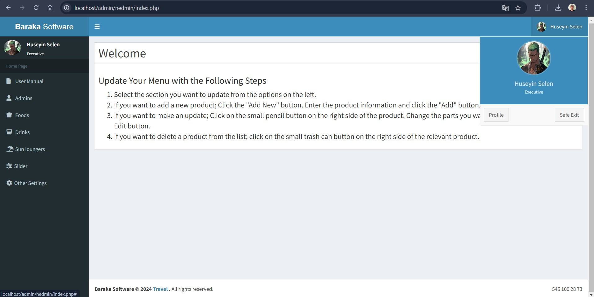
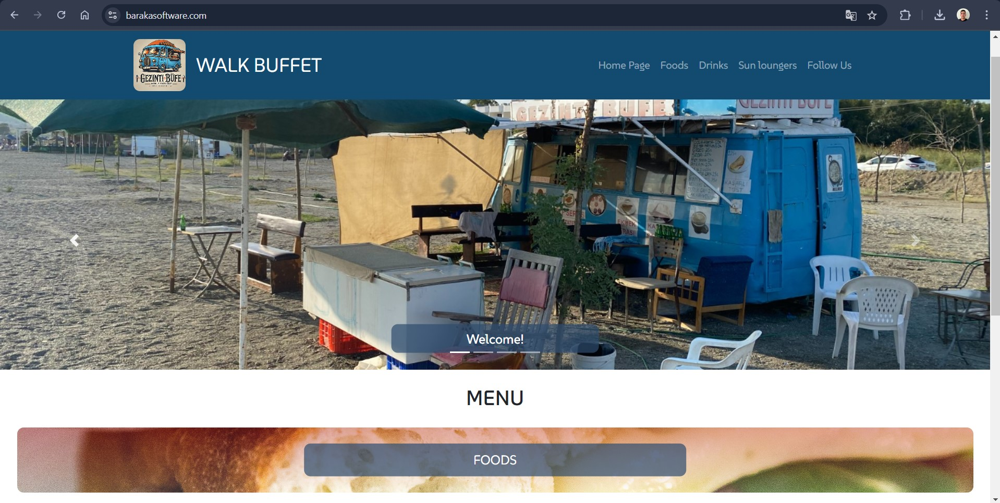

# Baraka Software

This repository contains the project **www.barakasoftware.com**. The project is designed to manage the **menu of buffet** and is **currently live on the internet**.

## About the Project
This is my first independently developed project, making it a significant milestone in my coding journey.

For this project, **I handled everything from domain acquisition to hosting and server management**. The entire coding process is my own work, and **both the frontend (website) and the admin panel (CMS system) were developed by me**.

This project is fully **mobile-friendly**, ensuring that users can easily access and navigate the website from their smartphones and tablets.

Additionally, a **QR code** is displayed at the buffet, allowing customers to quickly connect to the website by scanning it with their mobile devices.

### Features
- **Frontend (Website):**
  - View the services and menu items offered by the buffet
  - Check product details and pricing
  - **Mobile-friendly design** for seamless access on smartphones and tablets
  - **QR code integration** for quick access

- **Admin Panel (CMS):**
  - Update product and pricing information
  - Manage product images
  - Modify buffet services

## Technologies Used
This project was developed using the following technologies:
- **Backend:** PHP
- **Frontend:** HTML, CSS, JavaScript
- **Database:** MySQL
- **Others:** Hosting management

## Live Demo
You can check out the live project at: [www.barakasoftware.com](https://www.barakasoftware.com)

## Project Images




## Installation & Usage
This project is open-source, and anyone can use or modify it. To install and run it locally:
1. Clone the repository:
   ```sh
   https://github.com/HuseyinSelen/baraka-cms.git
   ```
2. Set up a local server (e.g., XAMPP, LAMP, or MAMP).
3. Create your database and import the baraka_panel.sql file.
4. Configure the database connection in `nedmin/netting/dbconfig.php`.
5. Run the project on your local server.

## Contact
If you want to know more about this project, feel free to reach out to me:
- **Email:** selen.huseyin98@gmail.com

## 📜 License
This project is licensed under the MIT License.

If you like the project, don't forget to star the repository ⭐

